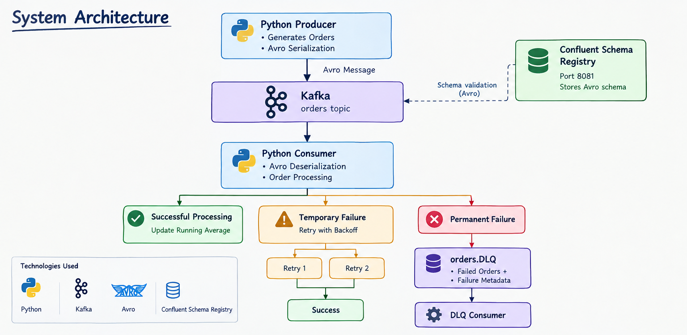
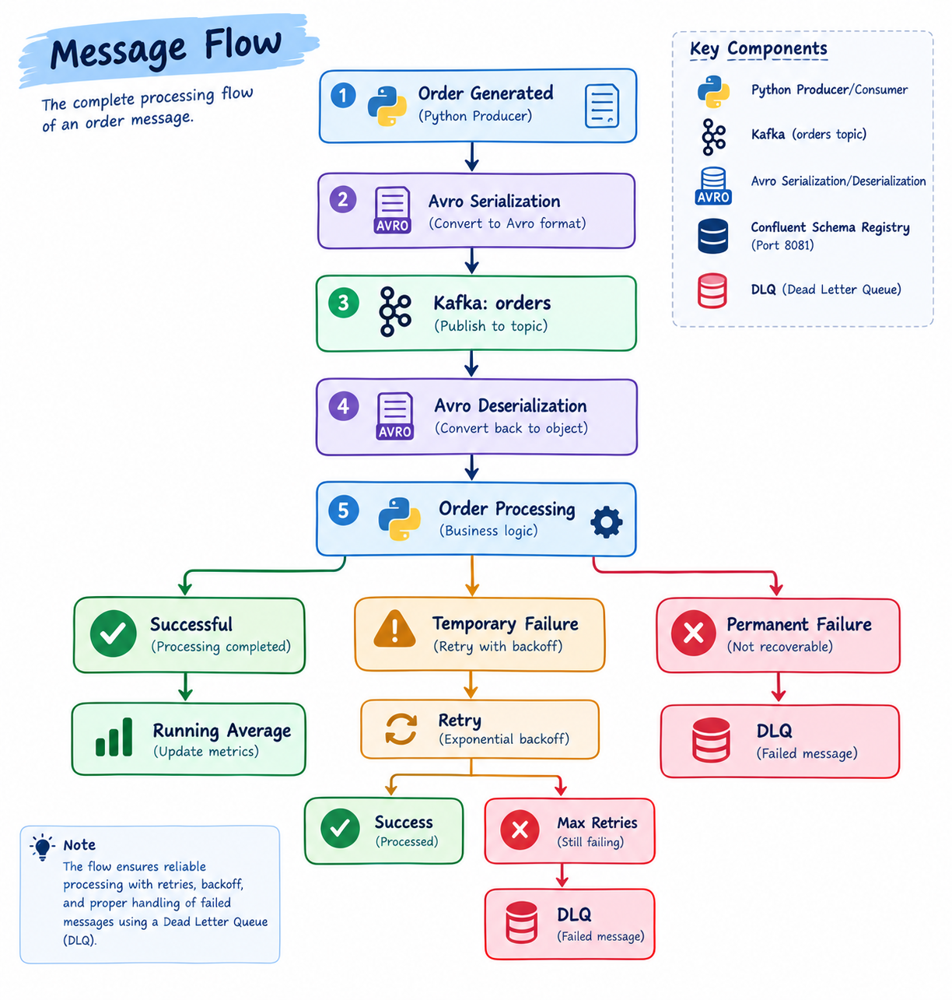
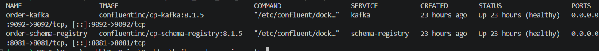
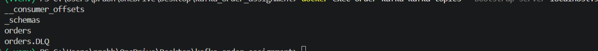
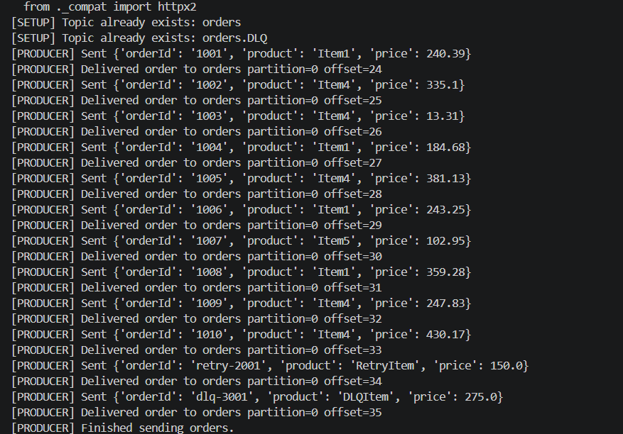
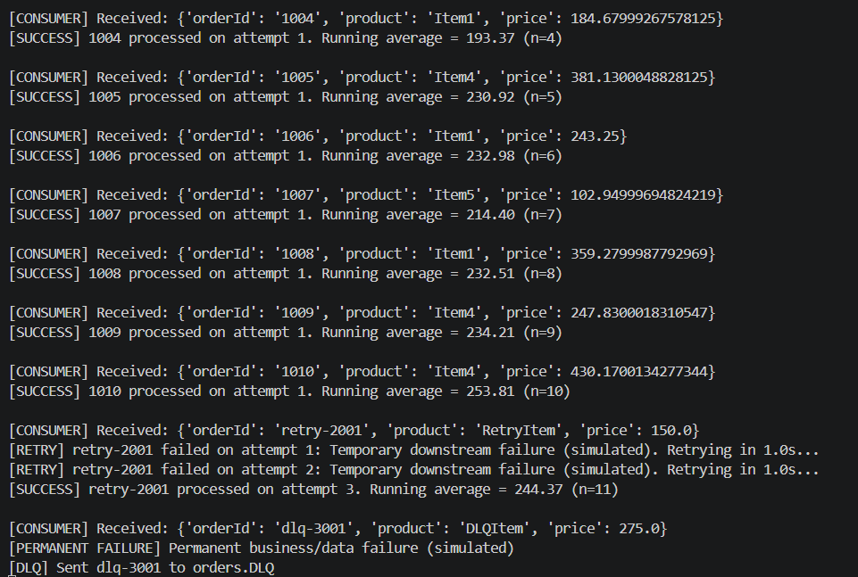
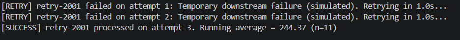
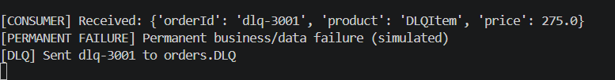
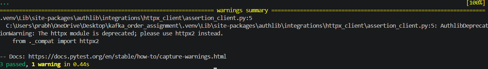

# StreamFlow - Real-Time Kafka Order Processing Pipeline

A real-time order processing pipeline built with **Python, Apache Kafka, Confluent Schema Registry, and Avro**.

The system demonstrates reliable event-driven order processing by producing Avro-serialized orders to Kafka, consuming and processing them in real time, maintaining a running average of successfully processed order prices, retrying temporary failures, and routing permanent failures to a Dead Letter Queue (DLQ).

---

##  Project Overview

**StreamFlow** implements a Kafka-based order processing workflow with the following capabilities:

* Real-time order production and consumption
* Avro serialization and deserialization
* Confluent Schema Registry integration
* Running average calculation of successful order prices
* Temporary processing failure detection
* Configurable retry handling with backoff
* Permanent failure handling
* Dead Letter Queue (DLQ) processing
* Kafka manual offset management
* Automated unit tests
* Docker-based Kafka and Schema Registry infrastructure
* Live demonstration of normal, retry, and DLQ scenarios

The project is designed so that the core processing behavior can be observed directly during a live demonstration.

---

## Architecture

The following diagram illustrates the overall order-processing architecture, including
Kafka, Avro serialization/deserialization, Confluent Schema Registry, retry handling,
and Dead Letter Queue (DLQ) processing.

<p align="center">
  
</p>
---

#  Technology Stack

| Technology                    | Purpose                                     |
| ----------------------------- | ------------------------------------------- |
| Python                        | Application implementation                  |
| Apache Kafka                  | Event streaming and message transport       |
| Confluent Kafka Python Client | Kafka producer/consumer API                 |
| Apache Avro                   | Message serialization and schema definition |
| Confluent Schema Registry     | Avro schema management                      |
| Docker Compose                | Kafka infrastructure                        |
| pytest                        | Automated testing                           |


---

---

#  Order Data Model

Each order contains the three required fields:

| Field     | Type   | Description             |
| --------- | ------ | ----------------------- |
| `orderId` | string | Unique order identifier |
| `product` | string | Product identifier/name |
| `price`   | float  | Order price             |

The schema is defined in:

```text
schemas/order.avsc
```

Example:

```json
{
  "type": "record",
  "name": "Order",
  "fields": [
    {
      "name": "orderId",
      "type": "string"
    },
    {
      "name": "product",
      "type": "string"
    },
    {
      "name": "price",
      "type": "float"
    }
  ]
}
```

---

#  Message Flow

The complete processing flow is:

<p align="center">
  
</p>


---

#  Kafka Topics

The system uses two application topics.

## `orders`

The main Kafka topic containing order events.

```text
orders
```

Normal orders, retry demonstration orders, and permanent-failure demonstration orders are initially published to this topic.

## `orders.DLQ`

The Dead Letter Queue for orders that cannot be successfully processed.

```text
orders.DLQ
```

The original order remains Avro-serialized, while failure information is carried in Kafka message headers.

---

#  Avro + Schema Registry

The producer uses the Avro schema defined in:

```text
schemas/order.avsc
```

The serialized messages are registered with and managed through Confluent Schema Registry.

Schema Registry runs on:

```text
http://localhost:8081
```

The Kafka broker runs on:

```text
localhost:9092
```

The expected Schema Registry subject for the order value is:

```text
orders-value
```

The DLQ retains the same Avro order structure and adds failure information through Kafka headers.

---

#  Running Average

The consumer calculates a running average of the prices of **successfully processed orders**.

The calculation is:

```text
Running Average =
Total price of successful orders
---------------------------------
Number of successful orders
```

For example:

```text
Order 1: 100
Average = 100 / 1 = 100.00

Order 2: 200
Average = (100 + 200) / 2 = 150.00

Order 3: 50
Average = (100 + 200 + 50) / 3 = 116.67
```

The implementation maintains only:

```text
total
count
```

rather than storing every processed price.

This allows the average to be updated incrementally as new successful orders arrive.

---

#  Retry Handling

The system distinguishes temporary processing failures from permanent failures.

Temporary failures raise:

```text
ProcessingFailure
```

These failures are retried according to the configured retry policy.

The demonstration order:

```text
orderId = retry-2001
product = RetryItem
price = 150.0
```

is intentionally configured to fail twice before succeeding on the third attempt.

Expected behavior:

```text
Attempt 1 → Temporary Failure
Attempt 2 → Temporary Failure
Attempt 3 → SUCCESS
```

Example:

```text
[RETRY] retry-2001 failed on attempt 1
[RETRY] retry-2001 failed on attempt 2
[SUCCESS] retry-2001 processed on attempt 3
```

The retry backoff is configurable through the project configuration.

---

#  Dead Letter Queue

Permanent processing failures raise:

```text
PermanentProcessingFailure
```

These failures do not need repeated retries and are sent directly to:

```text
orders.DLQ
```

The demonstration order:

```text
orderId = dlq-3001
product = DLQItem
price = 275.0
```

is intentionally configured to generate a permanent failure.

Expected behavior:

```text
Order received
      ↓
Permanent failure
      ↓
orders.DLQ
```

Example:

```text
[CONSUMER] Received:
{'orderId': 'dlq-3001', 'product': 'DLQItem', 'price': 275.0}

[PERMANENT FAILURE]
Permanent business/data failure (simulated)

[DLQ] Sent dlq-3001 to orders.DLQ
```

The DLQ message contains failure metadata including:

```text
errorType
errorMessage
attempts
failedAtEpoch
```

---

#  Offset Management

The consumer uses manual Kafka offset commits:

```text
enable.auto.commit = False
```

The consumer commits a message only after:

1. The order has been successfully processed, or
2. A failed order has been successfully published to the DLQ.

This prevents an order from being acknowledged before its processing outcome has been handled.

---

#  Getting Started

## Prerequisites

Install:

* Docker Desktop
* Docker Compose
* Python 3
* Git

---

## 1. Clone the Repository

```powershell
git clone https://github.com/prabhathmanthilaka/streamflow.git
cd streamflow
```


---

# 2. Create Python Virtual Environment

### Windows PowerShell

```powershell
py -m venv .venv
```

Activate:

```powershell
.\.venv\Scripts\Activate.ps1
```

Install dependencies:

```powershell
pip install -r requirements.txt
```


---

# 3. Start Kafka and Schema Registry

Run:

```powershell
docker compose up -d
```

Check the services:

```powershell
docker compose ps
```

Both Kafka and Schema Registry should be running/healthy.

---

# 4. Create Kafka Topics

Run:

```powershell
python -m src.setup
```

This creates:

```text
orders
orders.DLQ
```

Verify:

```powershell
docker exec order-kafka kafka-topics --bootstrap-server localhost:9092 --list
```

---

# 5. Start the Main Consumer

Open a new terminal.

Activate the virtual environment:

```powershell
.\.venv\Scripts\Activate.ps1
```

Run:

```powershell
python -m src.consumer
```

Expected:

```text
[CONSUMER] Listening for Avro orders. Press Ctrl+C to stop.
```

---

# 6. Start the Producer

Open another terminal.

Activate the virtual environment:

```powershell
.\.venv\Scripts\Activate.ps1
```

Run:

```powershell
python -m src.producer --count 10 --interval 0.5
```

The producer sends:

* Normal orders
* `retry-2001` demonstration order
* `dlq-3001` demonstration order

---

# 7. Start the DLQ Consumer

Open another terminal:

```powershell
.\.venv\Scripts\Activate.ps1
```

Run:

```powershell
python -m src.dlq_consumer
```

This consumer listens to:

```text
orders.DLQ
```

---

#  Testing

Run the automated test suite:

```powershell
python -m pytest -q
```

The verified project test result is:

```text
3 passed, 1 warning in 1.24s
```

The warning originates from a dependency compatibility warning and does not cause a test failure.

---

#  Live Demonstration

The system can be demonstrated using four terminals.

### Terminal 1 — Infrastructure

```powershell
docker compose up -d
```

Then:

```powershell
docker compose ps
```

### Terminal 2 — Main Consumer

```powershell
python -m src.consumer
```

### Terminal 3 — Producer

```powershell
python -m src.producer --count 10 --interval 0.5
```

### Terminal 4 — DLQ Consumer

```powershell
python -m src.dlq_consumer
```

---

## Demonstration Scenario 1 — Normal Processing

The producer publishes normal orders.

The consumer receives them and displays:

```text
[SUCCESS] 1001 processed on attempt 1.
Running average = ...
```

This demonstrates:

* Kafka consumption
* Avro deserialization
* Successful processing
* Running-average aggregation
* Offset commit

---

## Demonstration Scenario 2 — Retry

The producer sends:

```text
retry-2001
```

The consumer demonstrates:

```text
Attempt 1 → Failure
Attempt 2 → Failure
Attempt 3 → Success
```

This demonstrates temporary failure handling and retry behavior.

---

## Demonstration Scenario 3 — DLQ

The producer sends:

```text
dlq-3001
```

The consumer demonstrates:

```text
Permanent failure
       ↓
orders.DLQ
```

The DLQ consumer can then be used to inspect the failed message and associated failure metadata.

---

#  Live Execution Evidence

The following screenshots were captured from the working system during execution.

## 1. Kafka and Schema Registry



Shows the Docker containers running for Kafka and Schema Registry.

---

## 2. Kafka Topics



Shows the application topics:

```text
orders
orders.DLQ
```

---

## 3. Avro Producer



Shows orders being produced and successfully delivered to the Kafka `orders` topic.

---

## 4. Consumer and Running Average



Shows successful order processing and the running average being updated as orders are consumed.

---

## 5. Retry Mechanism



Shows the temporary failure scenario where `retry-2001` fails twice and succeeds on the third attempt.

---

## 6. Dead Letter Queue



Shows the permanent failure scenario and publication of `dlq-3001` to `orders.DLQ`.

---

## 7. Automated Tests



Shows the automated test suite completing successfully:

```text
3 passed
```

---


---

#  Configuration

Application configuration is maintained in:

```text
src/config.py
```

Environment-specific values can be supplied through environment variables where supported.

An example environment file is provided:

```text
.env.example
```

Actual environment files containing secrets or local configuration should not be committed.

---

#  Troubleshooting

## `ModuleNotFoundError: No module named 'confluent_kafka'`

Make sure the virtual environment is activated:

```powershell
.\.venv\Scripts\Activate.ps1
```

Then verify:

```powershell
python -c "import confluent_kafka; print('confluent-kafka OK')"
```

---

## `ModuleNotFoundError: No module named 'src'` when running pytest

Run pytest through the active Python environment:

```powershell
python -m pytest -q
```

instead of:

```powershell
pytest -q
```

---

## Kafka or Schema Registry is not running

Check:

```powershell
docker compose ps
```

If required, restart:

```powershell
docker compose down
docker compose up -d
```

---

## Reset the local Kafka environment

To stop the services:

```powershell
docker compose down
```

To remove the local Kafka/Schema Registry volumes as well:

```powershell
docker compose down -v
```

Use `-v` only when a complete local environment reset is required.

---

#  Git Hygiene

The repository intentionally excludes generated and local-only files such as:

```text
.venv/
__pycache__/
.pytest_cache/
*.pyc
.env
.vscode/
.idea/
```

These files are excluded through `.gitignore`.

---

#  Supporting Documentation

Additional project documentation is available in:

```text
docs/report.md
```

---

#  Project

**StreamFlow — Real-Time Kafka Order Processing Pipeline**

Built to demonstrate event-driven processing with Kafka, Avro, Schema Registry, retries, running aggregation, and Dead Letter Queue handling.
